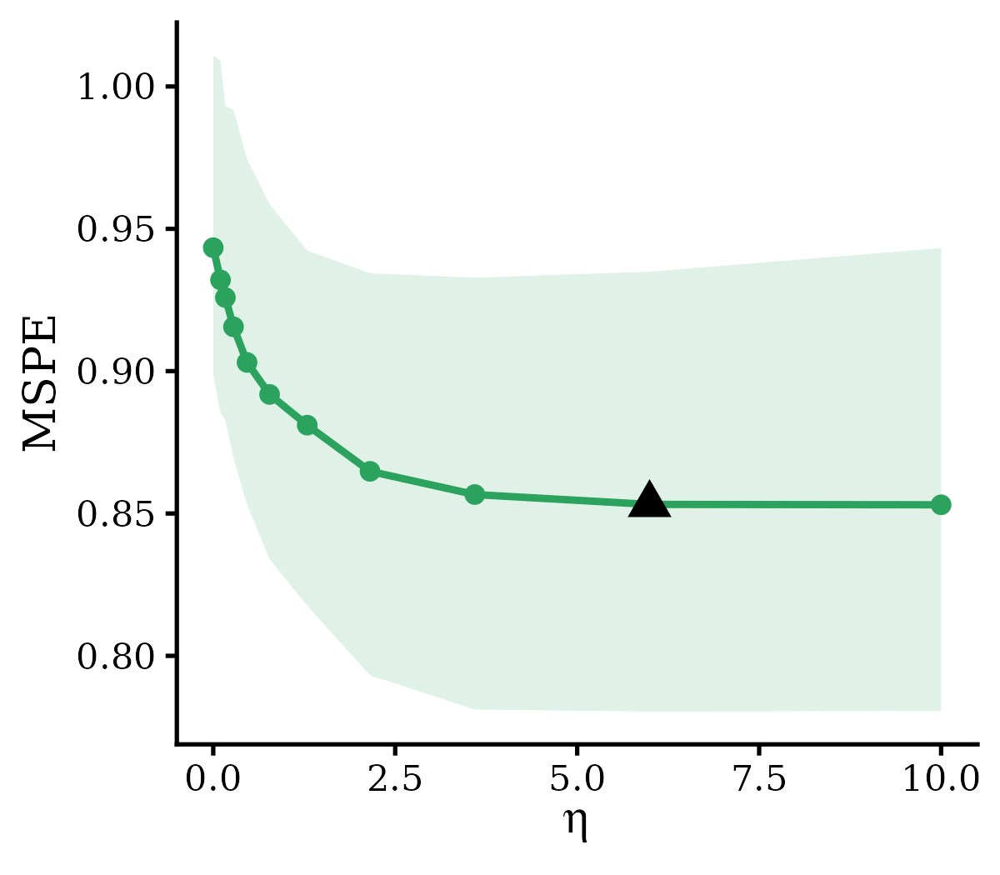
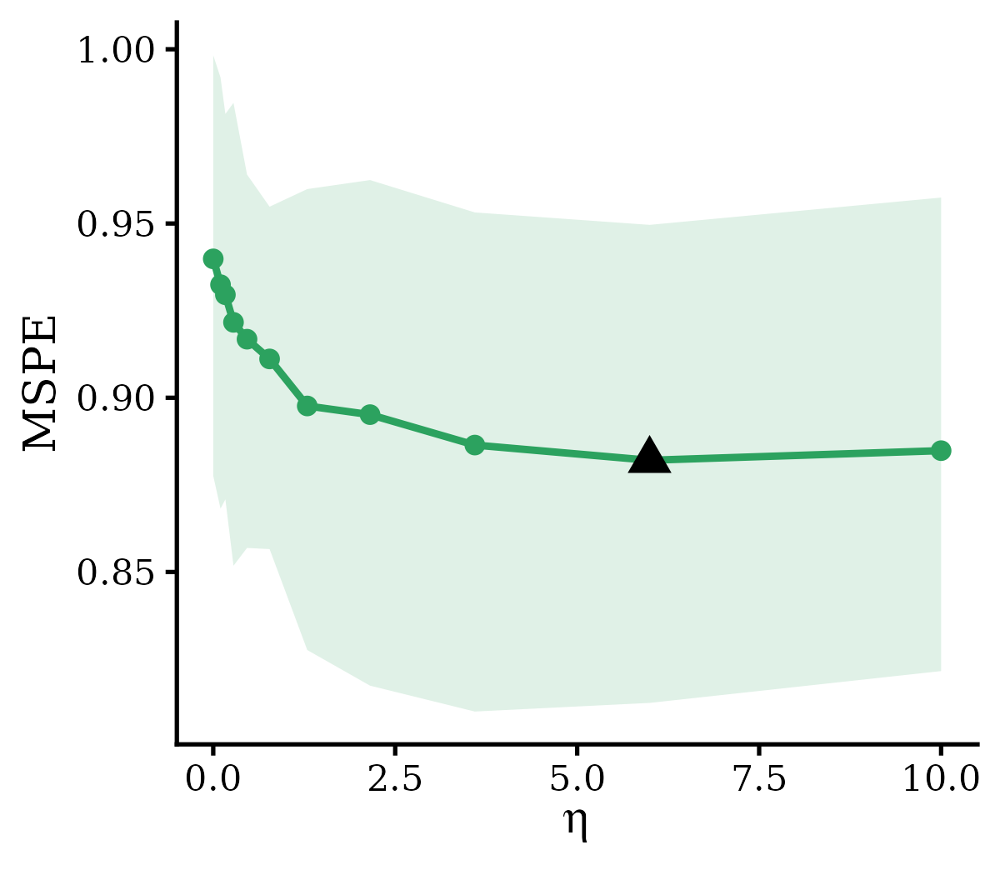
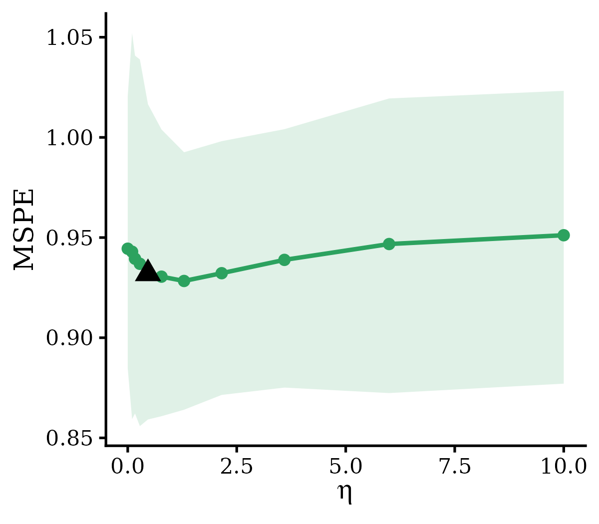
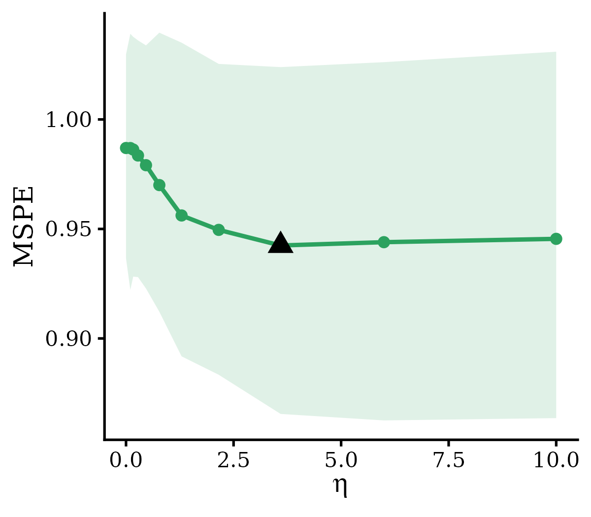
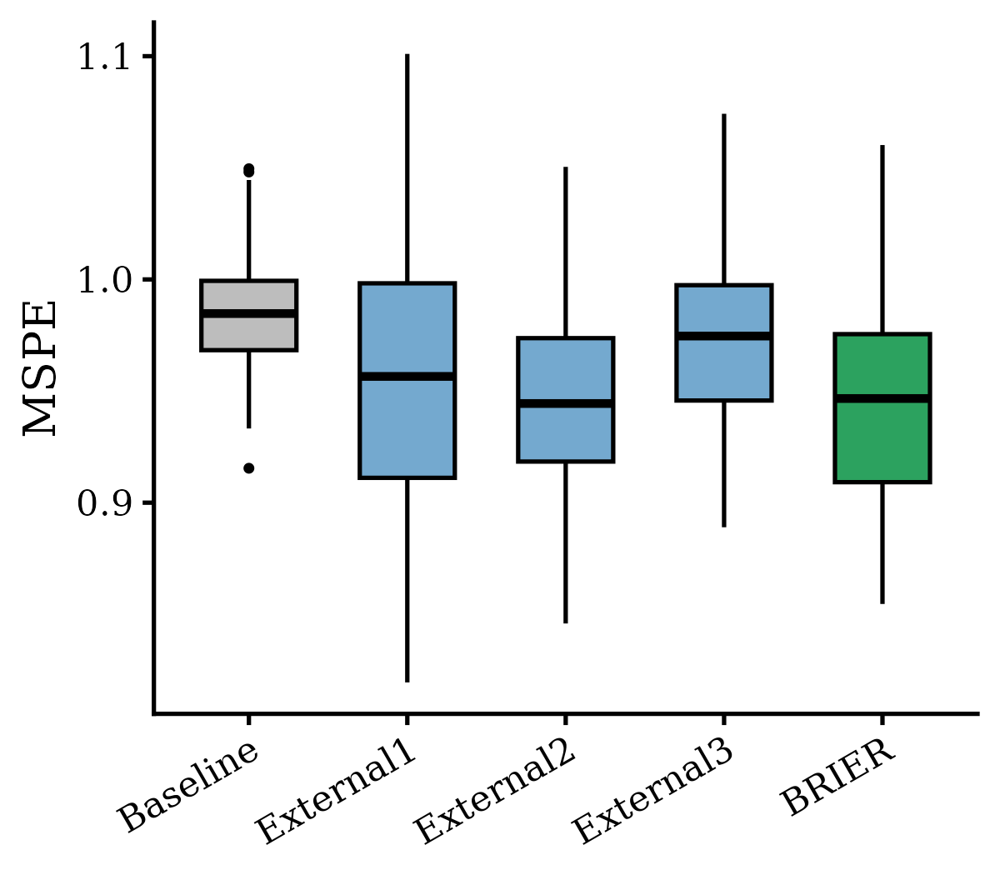

# 1. Introduction

In many genetic risk prediction applications, multiple external models are available rather than a single source. For example, in genetically regulated expression (GReX) modeling for transcriptome-wide association studies (TWAS), the goal is to predict tissue-specific gene expression from genotype data, and the target tissue of interest is often paired with eQTL summary statistics from many related tissues collected by the GTEx project (e.g., 49 tissues in GTEx v8). Since cis-eQTL effects are often shared across biologically related tissues, leveraging external models trained in non-target tissues can substantially improve predictive performance in the target tissue, particularly for tissues with limited sample size. Naively integrating each external model with its own integration weight, however, leads to a hyperparameter space that grows exponentially in the number of external sources, making joint tuning computationally prohibitive.

To address this, `BRIER` provides three strategies for integrating multiple external models, controlled by the `multi.method` argument:

- `"ind"`: each external model is assigned its own independent integration weight $\eta_m$. This is the most flexible option, but the hyperparameter space grows multiplicatively with the number of external sources, so it is only computationally practical when the number of external models is small (typically $M \leq 3$).
- `"pca"`: the external coefficient matrix is reduced to a small number of leading principal components, and only the top components are retained for integration. This collapses the multidimensional penalty space into a low-dimensional one and reduces tuning cost.
- `"stacking"`: the external models are first combined into a single ensemble model using stacking weights estimated from the target data, and the resulting ensemble is then integrated with the target through a single one-dimensional integration weight $\eta$. This avoids joint optimization over multiple external-model weights while retaining flexible information borrowing across sources.

Based on extensive simulation studies and real-data analyses, we recommend the `"stacking"` strategy. It consistently achieves predictive performance comparable to the gold-standard `"ind"` approach (which jointly tunes a separate integration weight for each external model) while substantially reducing computational burden. Methodological details for all three strategies are provided in the [Appendix: Model Details](Appendix_Model.html).

In this vignette, we use `BRIERs()` (summary-level data) as an illustrative example. The same workflow applies to `BRIERi()` (individual-level target data with pre-trained external models), with the only difference being the function name and the form of the inputs.


# 2. Before integrating all external models

Users may have access to multiple external models, but it is often undesirable to include all of them in the final integration. Some external models may be well aligned with the target data and improve predictive performance, whereas others may be highly heterogeneous and provide little or no benefit. As a diagnostic step, we recommend integrating each external model individually with the target data and evaluating predictive performance on a testing set. The function `plot.eta` (see [Section 6.1 of the main vignette](BRIER.html#sec-eval)) can then be used to visualize predictive performance as a function of the integration weight $\eta$, providing a direct read on the degree of heterogeneity between the target data and each external source.

The example below fits three single-external-model `BRIERs` integrations, each pairing the same target dataset with a different external model from the built-in dataset `Data_BRIERs`:

```{r, echo = TRUE, eval = FALSE}
library(BRIER)

data("Data_BRIERs")
data <- Data_BRIERs

## Shared target-cohort preprocessing
X <- data$target$train$X
summary <- data$target$train$sumstats
summary$corr <- p2cor(summary$pval, summary$n, sign = sign(summary$stats))
XtX.list <- calLD(X, summary)

X_val <- standardize_X(data$target$validation$X)[[1]]
y_val <- standardize_X(as.matrix(data$target$validation$y))[[1]]

eta.list <- c(0, exp(seq(log(0.1), log(10), length.out = 10)))

## Fit, tune, and visualize one external model at a time
for (m in 1:3) {
  fit <- BRIERs(
    sumstats = summary,
    XtX = XtX.list$XtX,
    beta.external = data$beta.external[, m],
    eta.list = eta.list
  )
  fit <- BRIERs.selection(
    fit, criteria = "gaussian.mspe",
    X.val = X_val, y.val = y_val
  )
  out <- plot.eta(
    fit,
    X = data$target$testing$X,
    covar.data = data$target$testing$y,
    criteria = "gaussian.mspe",
    standardize.data = TRUE,
    bootstrap = TRUE
  )
  print(out$plot)
}
```

The resulting $\eta$-curves for the three external models are summarized in the figure below. External models 1 and 2 show a clear improvement in predictive MSPE as $\eta$ increases, indicating relatively low heterogeneity with the target data. In contrast, external model 3 (dashed light-green curve) shows no improvement across values of $\eta$, suggesting substantial heterogeneity. Based on this diagnostic, users may reasonably exclude the third external model from the joint integration and proceed with only the first two.

<div style="display: flex; justify-content: space-between;">
  
  
  
</div>


# 3. Fitting `BRIERs` with multiple external models

Once the relevant external models have been selected, all of them can be passed to `BRIERs()` as a single coefficient matrix `beta.external`, with one column per external model. The aggregation strategy is specified through the `multi.method` argument.

## 3.1 Data format and preprocessing

We begin by loading the example dataset and preparing the target-cohort summary statistics, LD matrix, and stacked external coefficient matrix:

```{r, echo = TRUE, eval = FALSE}
data("Data_BRIERs")
data <- Data_BRIERs

X <- data$target$train$X
summary <- data$target$train$sumstats
summary$corr <- p2cor(summary$pval, summary$n, sign = sign(summary$stats))
XtX.list <- calLD(X, summary)

## All three external models combined into a single coefficient matrix
beta.external <- data$beta.external
dim(beta.external)
# [1] p 3
```

Each column of `beta.external` corresponds to one external model, and the rows must be aligned with the columns of the target predictor matrix. When external models are obtained from published studies (e.g., published PRS weights), users may need to reconstruct the coefficient vectors so that they match the target predictor set, assigning zero to predictors absent from a given external model. For genetic risk prediction with GWAS summary statistics, the helper function `PreprocessS()` performs this alignment automatically; see [Appendix: Data Processing of Genetic Risk Prediction using BRIERs](Appendix_Preprocess.html) for details.

## 3.2 Fitting `BRIERs` with `multi.method = "stacking"`

The function call is identical to the single-external-model case shown in the main vignette, except that `beta.external` is now a matrix and the aggregation strategy is specified through `multi.method`:

```{r, echo = TRUE, eval = FALSE}
fit <- BRIERs(
  sumstats = summary,
  XtX = XtX.list$XtX,
  beta.external = beta.external,
  eta.list = c(0, exp(seq(log(0.1), log(10), length.out = 10))),
  multi.method = "stacking"
)
```

To use a different aggregation strategy, simply replace `multi.method` with `"pca"` or `"ind"`. We note that `multi.method = "ind"` introduces one integration weight per external model, so the candidate set passed to `eta.list` should be specified as a list of vectors of length $M$ rather than a single vector. See the [Methods Appendix](LINK) for additional details.

## 3.3 Hyperparameter tuning

Hyperparameter tuning for `BRIERs` with multiple external models is performed using the same `BRIERs.selection()` interface as in the single-external-model case. Both an independent validation set and information-based criteria (`Cp`, `GIC`, `pseu.val`) are supported.

```{r, echo = TRUE, eval = FALSE}
X_val <- standardize_X(data$target$validation$X)[[1]]
y_val <- standardize_X(as.matrix(data$target$validation$y))[[1]]

fit <- BRIERs.selection(
  fit, criteria = "gaussian.mspe",
  X.val = X_val,
  y.val = y_val
)
```

See [Section 5.3 of the main vignette](BRIER.html#sec-BRIERs) for a full discussion of the available tuning criteria.


# 4. Evaluating the integrated model

Once `BRIERs.selection()` has identified the optimal $(\eta, \lambda)$, the same downstream evaluation tools described in [Section 6 of the main vignette](BRIER.html#sec-downstream) can be applied without modification. Below, we illustrate `plot.eta` and `plot.box` evaluated on an independent testing set:

```{r, echo = TRUE, eval = FALSE}
## Predictive performance as a function of eta on the testing set
out <- plot.eta(
  fit,
  X = data$target$testing$X,
  covar.data = data$target$testing$y,
  criteria = "gaussian.mspe",
  standardize.data = TRUE,
  bootstrap = TRUE
)
out$plot

## Bootstrap distribution of predictive performance
out <- plot.box(
  fit,
  X = data$target$testing$X,
  covar.data = data$target$testing$y,
  criteria = "gaussian.mspe",
  standardize.data = TRUE
)
out$plot
```

<div style="display: flex; justify-content: space-between;">
  
  
</div>

The left panel displays predictive MSPE on the testing set as a function of the integration weight $\eta$, with bootstrap-based uncertainty bands. The right panel summarizes the distribution of MSPE across bootstrap resamples for the target-only model, the external ensemble alone, and the integrated `BRIERs` model. Together, these two views provide a complete picture of how the multi-source integration performs relative to its constituent models.


# 5. Extending to `BRIERi`

When individual-level target data are available together with multiple pre-trained external models (rather than summary-level data), `BRIERi()` follows exactly the same workflow described above. The only differences are:

- the inputs are an individual-level design matrix `X` and outcome vector `y`, rather than `sumstats` and `XtX`;
- the multi-external coefficient matrix is passed through the same `beta.external` argument, with one column per external model and an intercept row included;
- hyperparameter tuning uses `BRIERi.selection()` and additionally supports cross-validation (`BRIERi.cv()`) in addition to validation-set and information-criterion-based tuning.

See [Section 4 of the main vignette](BRIER.html#sec-BRIERi) for the single-external-model `BRIERi` workflow; the multi-external-model extension follows the same pattern as Sections 3–4 of this appendix.