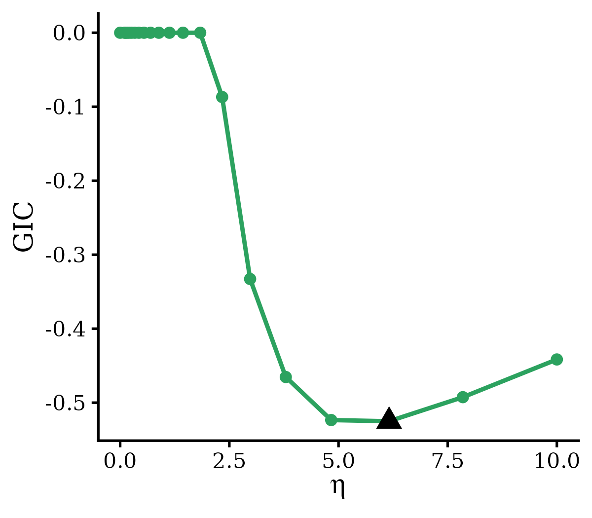

# 1. Introduction

When modeling with genotypes to model the polygenic risk of complex traits, the data preprocessing needs extra cautious. For example, mis-alignment of Flipped reference/alternative alleles between target and external source bring challenges/XXXother words; chromosome misalignment standardardizaiton X/Y (1, chr1, Chr1 etc). Here we provide helper funtions `preprocessI()` for data preprocessing of `BRIERi()` modeling and `preprocessS()` for data preprocessing of `BRIERs()` modeling.

# 1. Introduction {#sec-Introduction}

When genotype data are used for genetic risk prediction, careful preprocessing is essential to ensure that predictors, alleles, and genomic coordinates are consistently defined across data sources. This step is particularly important for integrative modeling, where target-cohort data are combined with external models or external summary statistics.

Several common issues can lead to incorrect model fitting or biased prediction. For example, reference and alternative alleles may be flipped between the target and external sources, leading to inconsistent coding of genetic effects. Chromosome labels may also be represented differently across files, such as `1`, `chr1`, or `Chr1`. In addition, variant identifiers, genomic positions, allele ordering, and genotype standardization must be harmonized before applying transfer-learning-based models.

To facilitate these preprocessing steps, `BRIER` provides helper functions for genotype-based modeling:

- `preprocessI()` prepares input data for `BRIERi()` when individual-level target data and external model coefficients are available.
- `preprocessS()` prepares input data for `BRIERs()` when target summary statistics and external model coefficients are available.

These functions are designed to help users align variants, harmonize allele coding, standardize chromosome and position information, and construct model-ready inputs for downstream BRIER analysis.


# 2. `preprocessI()` {#sec-preprocessI}

## 2.1 Basic Usage

The function `preprocessI()` prepares genotype-based inputs for `BRIERi()` when individual-level genotype data are available in the target cohort and one or more external models are available as SNP-level coefficients.

The argument `target.info` takes a `data.frame` describing the SNPs in the target genotype matrix, where each row corresponds to one column of the target predictor matrix. Users must specify the column mapping through target.info.cols. The argument `external.ss` takes an optional `data.frame` containing external model coefficients. When `external.ss` is provided, users must specify the SNP-annotation column mapping through `external.ss.cols` and the coefficient columns through `external.coef.cols`.

`preprocessI()` first performs quality control and harmonization separately for the target SNP information and external model coefficients. Specifically, it:

- standardizes SNP annotation columns to `CHR`, `BP`, `REF`, and `ALT`, corresponding to chromosome, base-pair position, reference allele, and alternative allele;
- normalizes chromosome labels to a common format, including `1`--`22`, `X`, `Y`, `MT`, and `XY`;
- removes SNPs with invalid or unrecognized chromosome labels;
- removes multi-allelic sites, defined as duplicated `CHR:BP` entries within each input;
- optionally removes strand-ambiguous SNPs, including A/T and C/G variants, using the `drop.ambiguous` argument.

`preprocessI()` also aligns external SNP coefficients to the target cohort. Specifically, it:

- SNP identifiers are standardized using the target-cohort allele orientation as `CHR:BP:REF:ALT`.
- External SNPs are matched to target SNPs by chromosome and base-pair position (`CHR:BP`).
- If the external `REF` and `ALT` alleles match the target-cohort orientation, the external coefficient is retained unchanged.
- If the external `REF` and `ALT` alleles are reversed relative to the target-cohort orientation, the external coefficient sign is flipped.
- If the external alleles conflict with the target alleles, the external coefficient is set to zero (a conflict means the alleles disagree beyond a simple flip, e.g., A/G vs A/T at the same position, usually indicating a different variant).
- SNPs present in external models but absent from the target cohort are removed.
- SNPs present in the target cohort but absent from an external model are retained and assigned an external coefficient of zero.

`preprocessI()` returns a list containing the main processed inputs required for downstream `BRIERi()` analysis:

- `target.info`: processed target SNP information, including standardized columns `varnames`, `CHR`, `BP`, `REF`, and `ALT`;
- `target.info.keep`: indices of SNPs retained after quality control, which can be used to subset the columns of the target genotype matrix;
- `external.ss`: processed and target-aligned external model coefficients, with coefficient columns renamed as `coef1`, `coef2`, ..., when external models are provided;
- `external.coef.names`: a mapping between the standardized coefficient names and the original external coefficient column names;
- `summary`: a named vector summarizing the number of SNPs retained, removed, matched, flipped, zero-padded, or excluded during preprocessing.


## 2.2 Example usage

We illustrate the use of `preprocessI()` using a height PRS prediction example from the Michigan Genomics Initiative (MGI). In this example, the target cohort consists of 2,162 individuals of African ancestry (AFR), and the predictor set includes the top 10,000 SNPs ranked by marginal association. Two external models are provided: one trained using MGI European-ancestry (EUR) data and one derived from a published EUR GWAS with a larger set of 163,140 SNPs.

```{r, echo = TRUE, eval = FALSE}
library(BRIER)

data("Data_preprocessI")
dat <- Data_preprocessI
names(dat)
# [1] "target.info"    "external.coef1" "external.coef2"
```

The function `mergeExternals()` can be used to combine multiple external SNP-level coefficient files into a single wide-format data frame. This is useful when users want to integrate more than one external model in downstream `preprocessI()` or `preprocessS()` analysis.

Each input external model should be provided as a `data.frame` with the required columns `CHR`, `BP`, `REF`, `ALT`, and `coef`. The function first applies the same basic genotype harmonization steps to each external model, including chromosome-code normalization, optional removal of strand-ambiguous SNPs, and removal of multi-allelic sites. It then constructs the union of SNPs across all external models.

For SNPs shared across models, the first external model containing a given `CHR:BP` defines the canonical `REF`/`ALT` orientation in the merged output. Coefficients from subsequent models are then aligned to this canonical orientation:

- if the alleles match the canonical orientation, the coefficient is retained unchanged;
- if the alleles are reversed relative to the canonical orientation, the coefficient sign is flipped;
- if the alleles conflict with the canonical alleles, the coefficient is set to zero (a conflict means the alleles disagree beyond a simple flip, e.g., A/G vs A/T at the same position, usually indicating a different variant);
- if a SNP is absent from a given external model, its coefficient for that model is set to zero.

The merged output contains columns `CHR`, `BP`, `REF`, `ALT`, followed by standardized coefficient columns `coef1`, `coef2`, ..., `coefM`, where `M` is the number of external models. The original model names are stored in the `coef.names` attribute. This merged data.frame can then be passed to `preprocessI()` or `preprocessS()` using `external.coef.cols = paste0("coef", seq_len(M))`.

```{r, echo = TRUE, eval = FALSE}
external.merged <- mergeExternals(list(dat$external.coef1, dat$external.coef2))
# Input SNPs per model (after CHR validation): external.list[[1]]=10000, external.list[[2]]=163140
# Union SNP set: 163140 variants across 2 model(s).
#   model1 (-> coef1): matched=10000, flipped=0, conflict=0, zero-padded=153140
#   model2 (-> coef2): matched=161641, flipped=1499, conflict=0, zero-padded=0
```

Then, we apply `preprocessI()` to harmonize the target SNP information with the merged external model coefficients and generate model-ready inputs for `BRIERi()`.

```{r, echo = TRUE, eval = FALSE}
processed <- preprocessI( 
  target.info = dat$target.info, 
  target.info.cols = c(chr = "CHR", bp = "BP", ref = "A2", alt = "A1"),
  external.ss = external.merged, 
  external.ss.cols = c(chr = "CHR", bp = "BP", ref = "REF", alt = "ALT"), 
  external.coef.cols = c("coef1", "coef2")
)
# Input SNPs: target.info=10000, external.ss=163140
# External: 9000 matched, 1000 flipped, 0 conflict, 0 zero-padded.
# Final analysis set: 10000 SNPs.

names(processed)
# [1] "target.info"         "target.info.keep"    "external.ss"        
# [4] "external.coef.names" "summary" 
```

Unfortunately, due to privacy constraints, we cannot share the raw MGI genotype matrix. Instead, we provide example code showing how the output from `preprocessI()` can be used to construct downstream inputs for `BRIERi()`.

```{r, echo = TRUE, eval = FALSE}
X <- X[, processed$target.info.keep]
# BRIERi requires an intercept slot as the first row of beta.external; BRIERs does not.
external.mat <- as.matrix(
  processed$external.ss[, grep("^coef", colnames(processed$external.ss)), drop = FALSE]
)
external.mat <- rbind(0, external.mat)

fit <- BRIERi(
  X, y, family = "gaussian", 
  beta.external = external.mat, 
  multi.method = "stacking"
)
```


## 2.3 Notes

When using `BRIERi()`, users may want to include non-genetic covariates, such as age, sex, genotype principal components, or other demographic variables. In this setting, genotype predictors and non-genetic covariates should be handled separately during preprocessing.

Specifically, only SNP-level information should be passed to `preprocessI()`. The target SNP annotation file should correspond only to the genotype columns in the target design matrix, and the external model coefficient file should contain only SNP-level coefficients. Non-genetic covariates and any external-model intercepts should not be included in `preprocessI()`.

After preprocessing, users can subset the genotype matrix using `processed$target.info.keep`, construct the aligned external SNP coefficient matrix from `processed$external.ss`, and then add back non-genetic covariates to the target design matrix before fitting `BRIERi()`.

In addition, `BRIERi()` expects the external coefficient matrix to include an intercept slot as the first row. If no intercepts are estimated from external models, this intercept slot should be set to zero. The intercept row is not required for `BRIERs()`.

```{r, echo = TRUE, eval = FALSE}
# SNP matrix after preprocessing
X.snp <- X.snp[, processed$target.info.keep]

# Add non-genetic covariates after SNP preprocessing
X.full <- cbind(age = age, sex = sex, X.snp)

# External SNP coefficients aligned by preprocessI()
beta.snp <- as.matrix(
  processed$external.ss[, grep("^coef", colnames(processed$external.ss)), drop = FALSE]
)

# Add rows for intercept and non-genetic covariates.
# Intercept is set to 0; covariate coefficients are also set to 0 unless
# external coefficients for these covariates are available and harmonized separately.
beta.external <- rbind(
  intercept = 0,
  age = 0,
  sex = 0,
  beta.snp
)

fit <- BRIERi(
  X = X.full,
  y = y,
  family = "gaussian",
  beta.external = beta.external,
  multi.method = "stacking"
)
```


# 3. `preprocessS()` {#sec-preprocessS}

## 3.1 Basic usage

The function `preprocessS()` prepares genotype-based summary-statistic inputs for `BRIERs()` when target-cohort individual-level genotypes are not available. Instead, users provide target summary statistics, a target LD reference panel, and optionally one or more external models as SNP-level coefficients.

The argument `target.ss` takes a `data.frame` containing target summary statistics. The argument `target.ld` takes a `data.frame` describing the SNPs in the target LD reference panel, where each row corresponds to one row/column of the LD matrix. The optional argument `external.ss` takes a `data.frame` containing external model coefficients. When `external.ss` is provided, users must specify the SNP-annotation column mapping through `external.ss.cols` and the coefficient columns through `external.coef.cols`.

`preprocessS()` first performs quality control and harmonization separately for the target summary statistics, the target LD reference panel, and external model coefficients. Specifically, it:

- standardizes SNP annotation columns to `CHR`, `BP`, `REF`, and `ALT`, corresponding to chromosome, base-pair position, reference allele, and alternative allele;
- normalizes chromosome labels to a common format, including `1`--`22`, `X`, `Y`, `XY`, and `MT`;
- removes SNPs with invalid or unrecognized chromosome labels;
- removes multi-allelic sites, defined as duplicated `CHR:BP` entries within each input;
- optionally removes strand-ambiguous SNPs, including A/T and C/G variants, using the `drop.ambiguous` argument.

When `target.ind = "gwas"`, `preprocessS()` converts GWAS summary statistics into marginal SNP-outcome correlations. In this setting, users must provide p-values, sample sizes, and either effect signs or beta coefficients. If beta coefficients are provided, the effect direction is inferred from the sign of beta. P-values equal to zero are replaced by the smallest observed non-zero p-value before computing correlations.

After quality control, `preprocessS()` uses the target LD reference panel as the canonical reference for SNP order and allele orientation. SNP identifiers in the processed output are written as `CHR:BP:REF:ALT`, where `REF` and `ALT` are defined according to the target LD reference panel.

The function then aligns target summary statistics and external model coefficients to the target LD reference panel. Specifically:

- target summary-statistic SNPs are matched to the LD reference panel by chromosome and base-pair position (`CHR:BP`);
- if the target summary-statistic alleles match the LD reference orientation, the marginal correlation is retained unchanged;
- if the target summary-statistic alleles are reversed relative to the LD reference orientation, the marginal correlation sign is flipped;
- SNPs without an allele-compatible match between the target summary statistics and the LD reference panel (in either the same or flipped orientation) are removed from the final analysis set.
- external SNP coefficients are matched to the surviving LD-reference SNPs by chromosome and base-pair position (`CHR:BP`);
- if the external `REF` and `ALT` alleles match the LD reference orientation, the external coefficient is retained unchanged;
- if the external `REF` and `ALT` alleles are reversed relative to the LD reference orientation, the external coefficient sign is flipped;
- if the external alleles conflict with the LD reference alleles, the external coefficient is set to zero;
- SNPs present in the final target/LD SNP set but absent from an external model are retained and assigned an external coefficient of zero;
- SNPs present only in external models but absent from the final target/LD SNP set are removed.

External models whose aligned coefficient columns are entirely zero are removed from the output. If all external models are removed after alignment, `external.ss` is returned as `NULL` with a warning.

`preprocessS()` returns a list containing the main processed inputs required for downstream `BRIERs()` analysis:

- `target.ss`: processed target summary statistics, including standardized columns `varnames`, `CHR`, `BP`, `REF`, `ALT`, and `corr`;
- `target.ld`: processed target LD reference SNP information, aligned to the final analysis SNP set;
- `target.ld.keep`: indices of SNPs retained from the original LD reference panel, which can be used to subset a precomputed LD matrix;
- `external.ss`: processed and LD-aligned external model coefficients, with coefficient columns renamed as `coef1`, `coef2`, ..., when external models are provided;
- `external.coef.names`: a mapping between the standardized coefficient names and the original external coefficient column names;
- `summary`: a named vector summarizing the number of SNPs retained, removed, matched, flipped, zero-padded, or excluded during preprocessing.


## 3.2 Example usage

We illustrate the use of `preprocessS()` using a height PRS prediction example from the Michigan Genomics Initiative (MGI). In this example, the target data consists of GWAS summary statistics derived from 2,162 African (AFR) individuals, and the predictor set includes the top 10,000 SNPs ranked by marginal association. Two external models are provided: one trained using MGI European-ancestry (EUR) data and one derived from a published EUR GWAS with a larger set of 163,140 SNPs.

```{r, echo = TRUE, eval = FALSE}
library(BRIER)

data(Data_preprocessS)

dat <- Data_preprocessS
names(dat)
# [1] "target.ss"      "target.ld"      "target.ld.mat"  "external.coef1"
# [5] "external.coef2"
```

As in the [previous example](#sec-preprocessI), multiple external models can first be merged using `mergeExternals()`. This step constructs the union of SNPs across external models and aligns their coefficients to a common allele orientation.

```{r, echo = TRUE, eval = FALSE}
external.merged <- mergeExternals(list(dat$external.coef1, dat$external.coef2))
# Input SNPs per model (after CHR validation): external.list[[1]]=10000, external.list[[2]]=163140
# Union SNP set: 163140 variants across 2 model(s).
#   model1 (-> coef1): matched=10000, flipped=0, conflict=0, zero-padded=153140
#   model2 (-> coef2): matched=161641, flipped=1499, conflict=0, zero-padded=0
```

Next, we apply `preprocessS()` to harmonize the target summary statistics, target LD reference panel, and merged external model coefficients. In this example, `target.ind = "gwas"` indicates that the target input is provided as GWAS summary statistics. The function uses p-values, sample sizes, and beta coefficients to compute marginal SNP-outcome correlations for `BRIERs()`.

```{r, echo = TRUE, eval = FALSE}
processed <- preprocessS( 
  target.ss = dat$target.ss, target.ind = "gwas", 
  target.ss.cols = c(chr = "CHR", bp = "BP", ref = "A2", alt = "A1", p = "P", n = "NMISS", beta = "BETA"),
  target.ld = dat$target.ld, 
  target.ld.cols = c(chr = "CHR", bp = "BP", ref = "A2", alt = "A1"), 
  external.ss = external.merged, 
  external.ss.cols = c(chr = "CHR", bp = "BP", ref = "REF", alt = "ALT"), 
  external.coef.cols = c("coef1", "coef2")
)
# Input SNPs: target.ss=10000, target.ld=10000, external.ss=163140
# Aligned 9000 SNPs in same orientation, 1000 in flipped orientation; 0 dropped (no allele match).
# External: 9000 matched, 1000 flipped, 0 conflict, 0 zero-padded.
# Final analysis set: 10000 SNPs.
```

The processed output can then be used to construct the inputs for `BRIERs()`. The target LD matrix should be subset using `processed$target.ld.keep`, and the aligned external coefficient matrix can be extracted from `processed$external.ss`. Unlike `BRIERi()`, `BRIERs()` does not require an intercept row in beta.external.

```{r, echo = TRUE, eval = FALSE}
LD.input <- dat$target.ld.mat[processed$target.ld.keep, processed$target.ld.keep]
external.mat <- as.matrix(
  processed$external.ss[, grep("^coef", colnames(processed$external.ss)), drop = FALSE]
)
fit <- BRIERs(
  sumstats = processed$target.ss, XtX = LD.input,
  family = "gaussian",
  beta.external = external.mat, 
  multi.method = "stacking"
)
```

If model selection is performed using criteria that require an estimate of SNP heritability, users may compute heritability externally and pass it to `BRIERs.selection()`. In this example, there are only 10,000 SNPs included, the heritability is not well estimated from package ldscr, therefore we use 0.

```{r, echo = TRUE, eval = FALSE}
ldsc_input <- dat$target.ss
ldsc_input$Z <- ldsc_input$STAT 
ldsc_input$N <- ldsc_input$NMISS
h2_res <- ldscr::ldsc_h2(munged_sumstats = ldsc_input, ancestry = "AFR")
fit <- BRIERs.selection(
  fit, criteria = "GIC", 
  TN = max(dat$target.ss$NMISS), 
  h2 = max(0, h2_res$h2_observed)
)
# Best eta: 6.158 
# Best lambda: 0 
```

The `plot.eta()` function visualize the selection of $\eta$ using GIC.

```{r, echo = TRUE, eval = FALSE}
out <- plot.eta(fit)
```
<div style="display: flex; justify-content: space-between;">
  
</div>


## 4. Practical preprocessing recommendations

In addition to the allele harmonization and SNP alignment implemented in `preprocessI()` and `preprocessS()`, we recommend applying standard genotype and summary-statistic quality-control steps before BRIER modeling.

Based on our experience, users may consider the following preprocessing steps:

- Remove insertion/deletion variants and structural variants, unless they are specifically included in the study design. Restricting to SNPs can reduce ambiguity in allele matching across target and external sources.
- Restrict analyses to biallelic variants. Multi-allelic sites can create ambiguous `CHR:BP:REF:ALT` definitions across datasets and are removed by the preprocessing functions.
- Filter variants by minor allele frequency. For common-variant PRS modeling, a typical choice is to retain variants with `0.01 <= MAF <= 0.99`. Less restrictive thresholds may be used when rare variants are of primary interest.
- Filter variants by imputation quality, for example retaining variants with imputation `R^2 >= 0.7` or another study-specific threshold.
- Remove variants showing strong deviation from Hardy--Weinberg equilibrium within the target cohort, when appropriate for the study design.
- Check and harmonize the genome build across all inputs, such as GRCh37/hg19 versus GRCh38/hg38. Variants should be represented on the same genome build before matching by chromosome and base-pair position. We recommend harmonizing all inputs to GRCh38/hg38 when possible. However, if a more suitable LD reference panel is only available in GRCh37/hg19, harmonize all inputs to GRCh37/hg19  instead. For example, one that is better ancestry-matched to the target cohort or derived from a larger reference sample. Avoid lifting the LD panel itself between builds, as coordinate conversion of LD reference data is error-prone. For coordinate conversion, users may refer to the [UCSC LiftOver tool](https://genome.ucsc.edu/cgi-bin/hgLiftOver) for both web-based and command-line conversion using chain files, or to the [GWAS Tutorial liftover guide](https://cloufield.github.io/GWASTutorial/LiftOver/) for a worked example of lifting summary statistics between assemblies.
- Use LD reference panels that are ancestry-matched to the target cohort whenever possible. This is particularly important for `BRIERs()`, where the LD matrix directly enters model fitting and should reflect the LD structure of the target population.
- We highly recommend LD pruning or clumping before model fitting to reduce memory usage and improve computational efficiency, especially when starting from a large genome-wide SNP set. [LD pruning](https://www.cog-genomics.org/plink/2.0/ld) and [clumping](https://www.cog-genomics.org/plink/2.0/postproc) can be performed using PLINK. 
