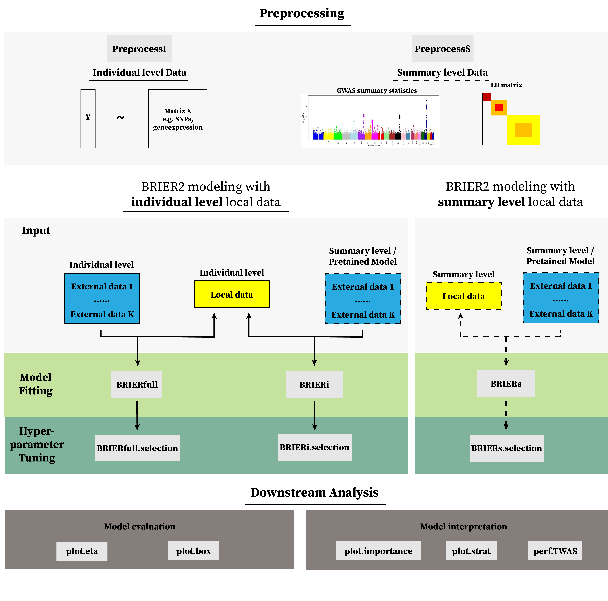

```{r setup, include = FALSE}
knitr::opts_chunk$set(
  eval = TRUE,
  warning = FALSE,
  message = FALSE
  )
```


# 1. Introduction

## 1.1 Background

Genetic risk prediction plays an increasingly important role in precision medicine by quantifying how inherited genetic variation contributes to complex traits. Approaches such as polygenic risk scores (PRS) for disease risk stratification, drug response prediction for individualized treatment, and genetically regulated expression (GReX) models for linking genetic variation to transcriptomic architecture illustrate the expanding influence of statistical genetics on biomedical research and its emerging role in clinical translation.

Despite these advances, prediction performance remains limited in clinically underrepresented populations with scarce data. To address these gaps, we previously introduced `BRIER` [LINK TO BRIER1], which integrates a well-powered external model with either individual- or summary-level data from a target cohort using a Bregman divergence framework. Here, we introduce `BRIER2`, a comprehensive update of the previous version. 

## 1.2 Key Modules

`BRIER2` implements a flexible Bregman-divergence based integration framework to improve prediction of complex traits in a target local cohort by leveraging information from external sources under diverse data-availability settings. The framework is implemented through three principled module functions, `BRIER.FULL`, `BRIER.I`, and `BRIER.S`. Below, we briefly describe the setting for which each function is designed and provide worked examples illustrating their use.

`BRIER.FULL` is designed for settings in which **individual-level data** are available in both the target cohort and the external cohort. In particular, both the outcome \(y\) and predictor matrix \(X\) are observed for samples from each data source.

`BRIER.I` is designed for settings in which **individual-level data** are available in the target cohort, but the external sources do not share raw data and instead provide only **pre-trained models** (e.g., published PRS weights, penalized regression coefficients). Such settings commonly arise in applications such as predicting binary disease status using gene expression profiles \citep{li2024_drugresponse}, or constructing genetic prognostic models for time-to-event outcomes \citep{wang2023_coxkl}.

`BRIER.S` is designed for settings where only summary statistics (e.g. GWAS summary statistics and LD matrix) are available in both target and external cohorts. This module is particularly useful for constructing predictors such as polygenic risk scores (PRS) \citep{li2022_bright} from GWAS summary statistics, or genetically regulated expression (GReX) models from eQTL summary statistics \citep{zhang2022_summit}.

We provide a flowchart outlining the `BRIER2` pipeline and its major components.

{width=100%}

## 1.3 Features

`BRIER2` provides a comprehensive and flexible framework for integrative genetic risk modeling, with the following key features:

- **Flexibility to integrate external information according to different data access and privacy constraints**
  `BRIER2` flexibly integrates external information with target data across a wide range of data-availability scenarios, including individual-level data, summary statistics, and pre-trained external models.
- **Support various distribution families from complex traits**  
  `BRIER2` supports a wide range of distribution families to accommodate continuous, binomial, count, and time-to-event outcomes.
- **A suite of hyperparameter tuning tools.**  
  Provide information-criterion based hyperparameter tuning for core modeling functions (`BRIERi.selection`, and `BRIERs.selection`) without requiring an independent validation set.
- **Integration of multiple external models.**  
  Ensemble-based weighting of multiple external models enables scalable integration of multiple information sources without inflating the hyperparameter space, substantially reducing computational burden.

In addition, `BRIER2` includes several features designed to improve practical usability in genetic applications:

- **Improved computational efficiency.**  
  Core components are fully optimized using Rcpp and support multi-core parallel computing, resulting in substantial runtime improvements for large-scale genetic analyses.
- **Support for imputed genotype data.**  
  The `calLD` module directly processes imputed genotype data in BGEN files to generate sparse LD matrices.
- **Precomputed ancestry-specific LD panels.**  
  Built-in LD reference panels for major global ancestries (EUR, AFR, EAS, SAS, AMR) are provided in both hg19 and hg38 genomic builds.
- **Model interpretability.**  
  A collection of downstream analysis and visualization tools is provided to facilitate evaluation and biological interpretation of fitted models.


# 2. Installation {#sec-install}

`BRIER2` requires the following R packages: `Rcpp`,`RcppArmadillo`, `Matrix`, `pROC`. These can be installed with
```{r, echo = TRUE, eval = FALSE}
install.packages(
    c("Rcpp", "RcppArmadillo", "Matrix", "BEDMatrix", "pROC"),
    dependencies = TRUE
)
```

The package can then be installed from GitHub using:
```{r, echo = TRUE, eval = FALSE}
remotes::install_github("UM-KevinHe/BRIER2", ref = "main")
```

After installation, load the package with:
```{r, echo = TRUE, eval = FALSE}
library(BRIER2)
```


# 3. `BRIERfull`: Modeling with individual-level target and external data {#sec-BRIERfull}

When individual-level data are available for both the target cohort and one or more external cohorts, `BRIERfull()` integrates external individual-level data with the target data through a weighted pseudo-likelihood framework. This setting represents the most information-rich use case, because both predictor and outcome data are available across cohorts.

To use `BRIERfull()`, users need to provide:

- a pooled individual-level predictor design matrix `X` containing observations from both the target and external cohorts;
- a phenotype or outcome vector `y` for all observations in the pooled data;
- an indicator vector `cohort` specifying the which cohort each observation belongs to;
- a list of tuning parameters `eta.list`, specifying the degree of information transferred from each external cohort. If a single vector is provided, it is automatically replicated across multiple external cohorts;
- model specification arguments, such as the outcome family `family` and penalty type `penalty`.

`BRIERfull()` currently supports continuous, binary, count, and time-to-event outcomes through Gaussian, Binomial, Poisson, and Cox regression models. Users should restrict the analysis to predictors that are shared across the target and external cohorts. 

In this section, we provide a toy example illustrating the use of `BRIERfull()` with the built-in dataset `Data_BRIERfull`.

## 3.1 Data format and preprocessing

We begin by loading the example dataset. The object contains one target cohort and three external cohorts.

```{r, echo = TRUE, eval = FALSE}
data("Data_BRIERfull")
names(data)
# [1] "target"    "external1" "external2" "external3"

X0 <- data$target$train$X 
y0 <- data$target$train$y
X1 <- data$external1$train$X 
y1 <- data$external1$train$y
X2 <- data$external2$train$X 
y2 <- data$external2$train$y
```

Next, we pool the individual-level data across cohorts. We note that the cohort indicator vector should be provided to denote the origin of each observation, where 0 indicates the target data and positive integers (e.g., 1, 2, …) indicate different external data sources.

```{r, echo = TRUE, eval = FALSE}
X <- rbind(X0, X1, X2)
y <- c(y0, y1, y2)
index <- c(rep(0, length(y0)), rep(1, length(y1)), rep(2, length(y2)))
```

## 3.2 Fitting `BRIERfull`

The function `BRIERfull()` fits a sequence of weighted generalized linear models that jointly models individual-level data from the target cohort and external cohort(s) through a list of integration weight $\eta$. Larger values of $\eta$ allow the model to integrate more information from the external cohort. The user should rely on prior knowledge or problem-specific considerations to determine an appropriate range of $\eta$'s.

```{r, echo = TRUE, eval = FALSE}
fit <- BRIERfull(
  X, y, cohort = index, 
  eta.list = c(0, exp(seq(log(0.1), log(10), length.out = 10)))
  )
```

## 3.3 Hyperparameters tuning

The \texttt{BRIER2} framework involves two classes of hyperparameters: the regularization parameter $\lambda$ and the integration weights $\{\eta_m\}_{m=1}^M$. For the regularization parameter $\lambda$, we adopt the classic regularization path strategy implemented in package \texttt{ncvreg} \citep{Breheny2011_ncvreg}, and provide a data-driven sequence of $\lambda$ for each $\eta$ value.

Tuning the integration weights $\eta$ is more challenging due to the heterogeneity between the target and external data sources. `BRIER2` provides two strategies for tuning $\eta$: grid search and Bayesian optimization, implemented through the `rBayesianOptimization` package. In this tutorial, we illustrate hyperparameter tuning using grid search. Additional details and examples for Bayesian optimization are provided in [Appendix: Selection of integration weight using Bayesian Optimization](Appendix_BayesianOptimization.html).

For grid search, `BRIERfull.selection()` evaluates model performance over user-specified candidate values of $\eta$ and the corresponding data-driven regularization path for $\lambda$. When an independent validation set is available, the function selects the optimal hyperparameter combination $(\{\eta_m\}_{m=1}^M, \lambda)$ according to a user-specified validation metric. The example below illustrates the use of mean squared prediction error (MSPE) as the evaluation metric for a continuous outcome. Additional evaluation metrics for different outcome types are provided in the [Appendix: Distribution Family and Evaluation Metrics](Appendix_Distr.html).


```{r, echo = TRUE, eval = FALSE}

fit <- BRIERfull.selection(
  fit, criteria = "gaussian.mspe", 
  X.val = data$target$validation$X,
  y.val = data$target$validation$y
)

```

Function `plot.eta` can be used to guide and visualize the selection of the best performing integration weight $\eta$, according to different evaluation metrics used in the validation set. The below figure displays the predictive performance (here, MSPE for a Gaussian outcome) evaluated on the validation set as a function of $\eta$. The optimal integration weight is identified as the value of $\eta$ that minimizes (or maximizes, depending on the metric) the evaluation criterion.

```{r, echo = TRUE, eval = FALSE}
plot.eta(fit)
```

<div style="display: flex; justify-content: space-between;">
  
</div>


# 4. `BRIERi`: modeling with individual-level target data and trained external models {#sec-BRIERi}

External individual-level data are often inaccessible due to privacy regulations or institutional agreements. Instead, external information may only be available in the form of trained prediction models, typically represented by estimated regression coefficients $\check{\beta}$. In this setting, `BRIER2` integrates external model information with individual-level target data through function `BRIERi()`.

To use `BRIERi()`, users need to provide:

- an individual-level predictor design matrix `X` from both the target cohort;
- a phenotype or outcome vector `y` from both the target cohort;
- a matrix of external coefficient estimates `beta.external`, where each column corresponds to one external model. The coefficient vector should include an intercept estimate;
- a list of tuning parameters `eta.list`, specifying the degree of information transferred from each external cohort. If a single vector is provided, it is automatically replicated across multiple external cohorts;
- model specification arguments, such as the outcome family `family` and penalty type `penalty`.

In this section, we provide a toy example illustrating the integration of a single external model using `BRIERi()` with the built-in dataset `Data_BRIERi`. To integrate multiple external models, `BRIERi()` provides several combination strategies through the argument `multi.method`, including direct use of multiple external models, principal component analysis (PCA)-based combination, and stacking-based combination. Details are provided in [Appendix: Integration of Multiple External Models](Appendix_Multiple.html).

## 4.1 Data format and preprocessing

We begin by loading the example dataset. The object contains one target cohort and a matrix of three external models.

```{r, echo = TRUE, eval = FALSE}
load("data/Data_BRIERfull.rda")
names(data)
# [1] "target"        "beta.external"
X <- data$target$train$X 
y <- data$target$train$y
beta.external <- data$beta.external[, 1]
```

## 4.2 Fitting `BRIERi`

The function `BRIERi()` fits a sequence of generalized linear models on the external cohort weighted response through a list of integration weight $\eta$. Larger values of $\eta$ allow the model to integrate more information from the external cohort. The user should rely on prior knowledge or problem-specific considerations to determine an appropriate range of $\eta$'s.

```{r, echo = TRUE, eval = FALSE}
fit <- BRIERi(
  X, y, 
  beta.external = beta.external, 
  eta.list = c(0, exp(seq(log(0.1), log(10), length.out = 10)))
)
```

## 4.3 Hyperparameters tuning

The \texttt{BRIER2} framework involves two classes of hyperparameters: the regularization parameter $\lambda$ and the integration weights $\{\eta_m\}_{m=1}^M$. For the regularization parameter $\lambda$, we adopt the classic regularization path strategy implemented in package \texttt{ncvreg} \citep{Breheny2011_ncvreg}, and provide a data-driven sequence of $\lambda$ for each $\eta$ value.

Tuning the integration weights $\eta$ is more challenging due to the heterogeneity between the target and external data sources. `BRIER2` provides two strategies for tuning $\eta$: grid search and Bayesian optimization, implemented through the `rBayesianOptimization` package. In this tutorial, we illustrate hyperparameter tuning using grid search. Additional details and examples for Bayesian optimization are provided in [Appendix: Selection of integration weight using Bayesian Optimization](Appendix_BayesianOptimization.html).

For grid search, `BRIERi` provides three criterion to evaluate each candidate pair of hyperparameters $(\eta, \lambda)$: cross-validation, evaluation on an independent validation set, and information-based criteria. The function `BRIERi.cv` performs cross-validation on the training data, using the predicted deviance as evaluation criteria, with the specific deviance definition provided in [Appendix: Distribution Family and Evaluation Metrics](Appendix_Distr.html).

```{r, echo = TRUE, eval = FALSE}
fit <- BRIERi.cv(X, y, beta.external = beta.external, eta.list = c(0, exp(seq(log(0.1), log(10), length.out = 10))))
# Best eta: 2.154 
# Best lambda: 0.212 
```

`BRIERi.selection` can also select the optimal hyper-parameters if an independent validation set is provided. Below displays an example of using MSPE as evaluation metric for continuous outcome. Additional evaluation metrics for different outcomes are provided in the [Appendix: Distribution Family and Evaluation Metrics](Appendix_Distr.html).  

```{r, echo = TRUE, eval = FALSE}
fit <- BRIERi.selection(
  fit, criteria = "gaussian.mspe", 
  X.val = data$target$validation$X,
  y.val = data$target$validation$y
)
# Best eta:  10 
# Best lambda: 0.184 
```

For continuous, binary, and count outcomes, users can also utilize information-based criteria to tune the optimal hyperparameters \((\eta, \lambda)\). We implemented Bayesian information criteria (BIC), Mallow's $C_p$ ($C_p$), and generalized cross validation (GCV;). The required arguments of different tuning methods are summarized in the table below. Detailed formula of information criteria is summarized in [Appendix: Information Criteria for Hyper-parameter Tuning](Appendix_IC.html).

Based on extensive simulation studies and real-data applications, we recommend `BIC`, as it consistently achieves better predictive performance.

```{r, echo = TRUE, eval = FALSE}
fit <- BRIERi.selection(
  fit, criteria = "BIC"
)
# Best eta:  10 
# Best lambda: 0.742 
```

The function `plot.eta` can be used to guide and visualize the selection of the optimal integration weight $\eta$ based on predictive performance under different evaluation metrics from cross-validation and an independent validation set, or based on information-criterion values. The left panel displays the predictive performance (here, MSPE for a Gaussian outcome) evaluated on the validation set as a function of $\eta$, while the right panel shows the corresponding information-criterion curve (e.g., Cp). The optimal integration weight is identified as the value of $\eta$ that minimizes (or maximizes, depending on the metric) the evaluation criterion.

```{r, echo = TRUE, eval = FALSE}
plot.eta(out)
```

<div style="display: flex; justify-content: space-between;">
  
  
</div>


# 5. `BRIERs`: modeling using summary level target and external data {#sec-BRIERs}

When only summary statistics are available for the target and external cohorts, `BRIER.S` provides a flexible framework for integrating target and external information using Bregman divergence. The most common source of such summary statistics is marginal GWAS analyses of the trait of interest and `BRIERs` model the polygenic risk of the trait of interest.

To use `BRIERs()`, users need to provide:

- A data frame `sumstats` of marginal correlation estimate from the target cohort;
- A sparse matrix `XtX` of correlation (LD) matrix from the target cohort; 
- a matrix of external coefficient estimates `beta.external`, where each column corresponds to one external model. The coefficient vector should not include an intercept estimate;
- a list of tuning parameters `eta.list`, specifying the degree of information transferred from each external cohort. If a single vector is provided, it is automatically replicated across multiple external cohorts;
- model specification arguments, such as the outcome family `family` and penalty type `penalty`.

We note that if only GWAS summary statistics or marginal correlation are available from external cohorts, users should train a joint model directly from summary-level data. `BRIER.S` currently supports modeling of continous, binary, and count outcomes.

In this section, we provide a toy example illustrating the integration of a single external model using `BRIERs()` with the built-in dataset `Data_BRIERs`. To integrate multiple external models, `BRIERs()` provides several combination strategies through the argument `multi.method`, including direct use of multiple external models, principal component analysis (PCA)-based combination, and stacking-based combination. Details are provided in [Appendix: Integration of Multiple External Models](Appendix_Multiple.html). 

## 5.1 Data format and preprocessing

We begin by loading the example dataset. The object contains one target cohort and a matrix of three external models. 

```{r, echo = TRUE, eval = FALSE}
load("data/Data_BRIERs.rda")
# [1] "target"        "beta.external"
X <- data$target$train$X 
```

Then, we calculate the marginal correlation estimate from marginal t-type test p values, sample size, and effect direction using the function `p2cor()`. The LD matrix from the target cohort is calculated using the function `calLD()`

```{r, echo = TRUE, eval = FALSE}
summary <- data$target$train$sumstats
summary$corr <- p2cor(summary$pval, summary$n, sign = sign(summary$stats))
XtX.list <- calLD(X, summary)
beta.external <- data$beta.external[, 1]
```

For genetic risk prediction using GWAS summary statistics, `BRIER2` also provides the helper function `PreprocessS()` for standard preprocessing in `BRIERs` modeling. Details are provided in [Appendix: Data Processing of Genetic Risk Prediction using BRIERs](Appendix_Appendix_Preprocess.html).

## 5.2 Fitting `BRIERs`

The function `BRIERs()` fits a sequence of generalized linear models on the external cohort weighted response through a list of integration weight $\eta$. Larger values of $\eta$ allow the model to integrate more information from the external cohort. The user should rely on prior knowledge or problem-specific considerations to determine an appropriate range of $\eta$'s. We highly recommend to specify the exact outcome family as it is important for downstream analysis.

```{r, echo = TRUE, eval = FALSE}
fit <- BRIERs(
  sumstats = summary, 
  XtX = XtX.list$XtX, 
  beta.external = beta.external, 
  family = "gaussian",
  eta.list = c(0, exp(seq(log(0.1), log(10), length.out = 10)))
)
```

## 5.3 Hyperparameters tuning

The \texttt{BRIER2} framework involves two classes of hyperparameters: the regularization parameter $\lambda$ and the integration weights $\{\eta_m\}_{m=1}^M$. For the regularization parameter $\lambda$, we adopt the classic regularization path strategy implemented in package \texttt{ncvreg} \citep{Breheny2011_ncvreg}, and provide a data-driven sequence of $\lambda$ for each $\eta$ value.

Tuning the integration weights $\eta$ is more challenging due to the heterogeneity between the target and external data sources. `BRIER2` provides two strategies for tuning $\eta$: grid search and Bayesian optimization, implemented through the `rBayesianOptimization` package. In this tutorial, we illustrate hyperparameter tuning using grid search. Additional details and examples for Bayesian optimization are provided in [Appendix: Selection of integration weight using Bayesian Optimization](Appendix_BayesianOptimization.html).

For grid search, `BRIERs` provides two criterion to evaluate each candidate pair of hyperparameters $(\eta, \lambda)$: evaluation on an independent validation set, and information-based criteria. 

The function `BRIERs.selection()` can select the optimal hyperparameters if an independent validation set is provided. We note that since `BRIERs()` generate standardized coefficient, it is highly recommended to standardized predictors and outcome in the validation and testing data set before hyperparameter tuning. Below displays an example of using MSPE as evaluation metric for continuous outcome. Additional evaluation metrics for different outcomes are provided in the [Appendix: Distribution Family and Evaluation Metrics](Appendix_Distr.html).  

```{r, echo = TRUE, eval = FALSE}
X_val <- standardize_X(data$target$validation$X)[[1]]
y_val <- standardize_X(as.matrix(data$target$validation$y))[[1]]
fit <- BRIERs.selection(
  fit, criteria = "gaussian.mspe", 
  X.val = X_val,
  y.val = y_val
)
# Best eta: 10 
# Best lambda: 0 
```

When an independent validation set is not available, users may rely on information-based criteria to tune the optimal hyperparameters \((\eta, \lambda)\). We implemented Generalized information criteria (GIC; specified by argument `criteria = "GIC"`), Mallow's $C_p$ ($C_p$; specified by argument `criteria = "Cp"`), and pseudo-validation (GCV; specified by argument `criteria = "pseu.val"`). The required arguments of different tuning methods are summarized in the table below. Detailed formula of information criteria is summarized in [Appendix: Information Criteria for Hyper-parameter Tuning](Appendix_IC.html).

Based on extensive simulation studies and real-data applications, we recommend $Cp$ or $GIC$, as it consistently achieves better predictive performance.

```{r, echo = TRUE, eval = FALSE}
fit <- BRIERs.selection(
  fit, criteria = "Cp", 
  TN = nrow(X), h2 = 0.2
)
# Best eta: 1.292 
# Best lambda: 0.029 
```

The function `plot.eta` can be used to guide and visualize the selection of the optimal integration weight $\eta$ based on predictive performance under different evaluation metrics from an independent validation set, or based on information-criterion values. The left panel displays the predictive performance (here, MSPE for a Gaussian outcome) evaluated on the validation set as a function of $\eta$, while the right panel shows the corresponding information-criterion curve (e.g., GIC). The optimal integration weight is identified as the value of $\eta$ that minimizes (or maximizes, depending on the metric) the evaluation criterion.

```{r, echo = TRUE, eval = FALSE}
plot.eta(out)
```

<div style="display: flex; justify-content: space-between;">
  
  
</div>


# 6. Downstream Analysis {#sec-downstream}

In this section, we introduce a suite of downstream analysis tools designed to facilitate performance evaluation, model diagnostics, and biological interpretation. These functions operate on a parameter-tuned `BRIER.selection` object generated from any of the three selection procedures (`BRIERfull.selection`, `BRIERi.selection` or `BRIERs.selection`). It outputs a list containing a ggplot2 object, and the original data for plotting.

## 6.1 Evaluation of `BRIER2` model {#sec-eval}

We introduce several functions for evaluating the predictive performance of fitted models. For complex outcome from different distribution family, we provide comprehensive evaluation metrics to evaluate `BRIER2` performance, for example, predictive deviance, AUC (binary outcomes), and C-index (survival outcomes). Additional details are provided in the [Appendix](LINK).  

### `plot.eta`  

Except guiding the selection of integration weight $\eta$ in parameter tuning, the `plot.eta` function visualizes predictive performance under user-specified evaluation metrics as a function of the integration weight $\eta$, if a testing set is provided. This plot is particularly useful for assessing heterogeneity between the target (target) data and external sources.

Specifically, `plot.eta` display the predictive performance evaluated on an independent testing set as a function of the integration weight parameter $\eta$, shown as the solid green curve. The light blue dotted line represents the predictive performance of the external model alone, and the black triangle marks the best $\eta$ selected during hyper-parameter tuning. 

In genetic applications such as polygenic risk score (PRS) evaluation, outcome measures often require adjustment for environmental or clinical confounders. In these settings, users should provide a `data.frame` containing the testing-set phenotype, along with the column names corresponding to the trait of interest and relevant confounders. The `standardize.y` option controls whether the phenotype is standardized after confounder adjustment. To further mitigate randomness in performance evaluation, bootstrap resampling is supported and can be used to obtain more stable estimates of predictive accuracy.

The $\eta$-curve highlights the implications of integrating varying degrees of external information into the construction of the integration model on the target population. As a result, it effectively portrays the levels of heterogeneity between datasets and provides guidance on the optimal degree of prior information incorporation. 

**Integrating low heterogeneous external information**

The example below illustrates the integration curves obtained when `BRIER2` incorporates external information with low heterogeneity relative to the target data. Model performance is evaluated using two metrics: Pearson’s $R^2$ (left panel) and mean squared prediction error (MSPE; right panel). As the integration weight $\eta$ increases and more external information is transferred to the target model, predictive performance improves, as indicated by an increase in Pearson’s $R^2$ and a decrease in MSPE. Performance reaches an optimum at an intermediate value of $\eta$ and may decline slightly thereafter. This pattern indicates that integrating external information improves predictive accuracy and suggests that the relative heterogeneity between the target and external data is low.

```{r, echo = TRUE, eval = FALSE}
p <- plot.eta(
  out, X = X_testing, y = y_testing, eval = "gaussian.pearsonrsq", pheno.name = "trait", adjust.covar = c("age", "sex"), 
  standardize.y = T, bootstrap = T, bootstrap.size = 0.8*nrow(X_testing), bootstrap.n = 100
  )
p
p <- plot.eta(
  out, X = X_testing, y = y_testing, eval = "gaussian.mspe", pheno.name = "trait", adjust.covar = c("age", "sex"), 
  standardize.y = T, bootstrap = T, bootstrap.size = 0.8*nrow(X_testing), bootstrap.n = 100
  )
```

<div style="display: flex; justify-content: space-between;">
  
  
</div>

**Integrating high heterogeneous external information**

The example below illustrates the integration curves obtained when `BRIER2` incorporates external information with high heterogeneity relative to the target data. Model performance is evaluated using two metrics: Pearson’s $R^2$ (left panel) and mean squared prediction error (MSPE; right panel). As the integration weight $\eta$ increases and more external information is transferred to the target model, predictive performance deteriorates, as indicated by an decrease in Pearson’s $R^2$ and a increase in MSPE. This pattern indicates that integrating external information does not improve predictive accuracy and suggests that the relative heterogeneity between the target and external data is high.

```{r, echo = TRUE, eval = FALSE}
p <- plot.eta(
  out, X = X_testing, y = y_testing, eval = "gaussian.pearsonrsq", pheno.name = "trait", adjust.covar = c("age", "sex"), 
  standardize.y = T, bootstrap = T, bootstrap.size = 0.8*nrow(X_testing), bootstrap.n = 100
  )
p
p <- plot.eta(
  out, X = X_testing, y = y_testing, eval = "gaussian.mspe", pheno.name = "trait", adjust.covar = c("age", "sex"), 
  standardize.y = T, bootstrap = T, bootstrap.size = 0.8*nrow(X_testing), bootstrap.n = 100
  )
```

<div style="display: flex; justify-content: space-between;">
  
  
</div>


**Multiple fitted BRIER2 objects**

A list of fitted BRIER.selection objects can also be supplied to this function. This functionality is particularly useful when multiple external models are available, as it allows users to assess the degree of heterogeneity between each external model and the same target (target) dataset, and to determine which external sources are likely to be beneficial for integration.

In the example below, three BRIER models are fitted by integrating different external models with the same target data. The model corresponding to the dashed light-green curve shows no improvement in predictive Pearson's $R^2$ (left) or mspe (right) across values of $\eta$, indicating substantial heterogeneity with the target data. Consequently, users may reasonably exclude this external model when jointly integrating multiple sources using `BRIER.multi`.

```{r, echo = TRUE, eval = FALSE}
p <- plot.eta(
  out.list, X = X_testing, y = y_testing, eval = "gaussian.mspe", pheno.name = "trait", adjust.covar = c("age", "sex"), 
  standardize.y = T, bootstrap = T, bootstrap.size = 0.8*nrow(X_testing), bootstrap.n = 100
  )
p
p <- plot.eta(
  out.list, X = X_testing, y = y_testing, eval = "gaussian.pearsonrsq", pheno.name = "trait", adjust.covar = c("age", "sex"), 
  standardize.y = T, bootstrap = T, bootstrap.size = 0.8*nrow(X_testing), bootstrap.n = 100
  )
p
```

<div style="display: flex; justify-content: space-between;">
  
  
</div>


### `plot.box`  

The `plot.box` function provides a complementary perspective for evaluating `BRIER` models. It visualizes the distribution of predictive performance across bootstrap resamples using boxplots, thereby capturing variability introduced by sampling randomness. Below, we illustrate `plot.box` under settings where the external information exhibits low and high heterogeneity relative to the target (target) data.

**Integrating low heterogeneous external information**

In the example below, the external model achieves stronger predictive performance than the target-only model (higher Pearson $R^2$ and lower MSPE), suggesting relatively low heterogeneity between the target and external data. By appropriately integrating external information, the `BRIER2` model further improves predictive accuracy, demonstrating the benefit of information borrowing when external sources are well aligned with the target population.

```{r, echo = TRUE, eval = FALSE}
p <- plot.box(
  out, X = X_testing, y = y_testing, eval = "gaussian.pearsonrsq", pheno.name = "trait", adjust.covar = c("age", "sex"), 
  standardize.y = T, bootstrap.size = 0.8*nrow(X_testing), bootstrap.n = 100
  )
p
p <- plot.box(
  out, X = X_testing, y = y_testing, eval = "gaussian.mspe", pheno.name = "trait", adjust.covar = c("age", "sex"), 
  standardize.y = T, bootstrap.size = 0.8*nrow(X_testing), bootstrap.n = 100
  )
p
```

<div style="display: flex; justify-content: space-between;">
  
  
</div>

**Integrating high heterogeneous external information**

In contrast, the example below illustrates a setting where the external model performs poorly relative to the target-only model (lower Pearson $R^2$ and higher MSPE), indicating substantial heterogeneity between the target and external data. As the integration weight increases, incorporating external information does not improve (and may even degrade) predictive performance. This pattern suggests that the external source is not well matched to the target population and may be excluded from joint integration.

```{r, echo = TRUE, eval = FALSE}
p <- plot.box(
  out, X = X_testing, y = y_testing, eval = "gaussian.pearsonrsq", pheno.name = "trait", adjust.covar = c("age", "sex"), 
  standardize.y = T, bootstrap.size = 0.8*nrow(X_testing), bootstrap.n = 100
  )
p
p <- plot.box(
  out, X = X_testing, y = y_testing, eval = "gaussian.mspe", pheno.name = "trait", adjust.covar = c("age", "sex"), 
  standardize.y = T, bootstrap.size = 0.8*nrow(X_testing), bootstrap.n = 100
  )
p
```

<div style="display: flex; justify-content: space-between;">
  
  
</div>


## 6.2 Variable importance {#sec-importance}

The `plot.importance` function provides a stability-based assessment of variable importance by repeatedly re-validation the fitted model on bootstrap resamples of the validation data. For each replication, the procedure records which predictors enter the model, and it summarizes their selection frequencies across all resamples. The resulting plot displays the predictors ranked by how consistently they are selected, offering an interpretable measure of feature importance that complements effect-size estimates. High-frequency markers indicate stable, reproducible signals that contribute to prediction performance, whereas low-frequency markers may reflect noise or dataset-specific fluctuations. This diagnostic is particularly valuable in high-dimensional genomic settings, where model sparsity and sampling variability can obscure truly informative predictors.

```{r, echo = TRUE, eval = FALSE}
p <- plot.importance(out, X = X_validation, y = y_validation, n.top = 10, replications = 100, seed = 1)
p
```

{width=50%}

By specifying `n.top = NA`, the `plot.importance` function will output the selection frequency distribution histogram for all prediction.

```{r, echo = TRUE, eval = FALSE}
p <- plot.importance(out, X = X_validation, y = y_validation, n.top = NA, replications = 100, seed = 1)
p
```

{width=50%}


## 6.3 PRS stratification {#sec-prs_strat}

The `plot.strat` presents the distribution of continuous traits in test data stratified by a percentile cut-off (Pct) of the target, external only model and `BRIER2` integration. These plots further visualize the discrimination power of each model. In the plots, we compare the median distance between the upper and lower percentile stratification of the observed outcome distribution, and show the distance in the title of the plots. [HOW TO QUANTIFY THIS]

```{r, echo = TRUE, eval = FALSE}
p <- plot.strat(out, X = X_testing, y = y_testing, lower = 0.4, upper = 0.4)
p
```

{width=50%}


## 6.4 Performing TWAS on trait of interest {#sec-TWAS}


